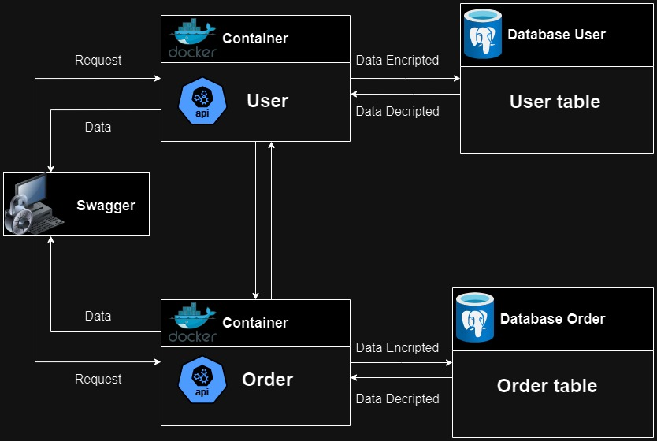

# MICROSERVIÇOS - DOCUMENTAÇÃO 🔎⬇ 

## |--- Sobre o projeto ⚙️🗂

Seja bem-vindo(a). Esta aplicação foi desenvolvida para fornecer uma plataforma segura para gerenciar dados sensíveis. Aqui está um overview das principais características:

- **Linguagem de programação**: A linguagem de programação escolhida para o projeto foi o ***Python*** 🐍, por ser extremament flexível, fácil de utilizar e por ter ótimas `libs` e `frameworks`. A aplicação foi desenvolvida na `versão 3.12.1`

- **Comunicação entre usuários e pedidos**: A aplicação facilita a comunicação entre usuários e pedidos por meio de [RestAPI](https://www.geeksforgeeks.org/rest-api-introduction/). Ela lida com autenticação de usuário, processamento de pedidos e armazenamento de dados no banco de dados

- **Desenvolvida com FastAPI**: A aplicação utiliza o `framework` [FastAPI](https://fastapi.tiangolo.com/) para construir APIs com ***Python***. O ***FastAPI*** oferece alto desempenho, programação assíncrona, injeção de dependência e documentação interativa

- **Docker**: Esta aplicação executa através de containers, permitindo fácil implantação e escalabilidade. O [Docker](https://www.docker.com/products/docker) fornece um ambiente consistente em diferentes plataformas e simplifica o gerenciamento de dependências

- **Criptografia de dados**: Para garantir a segurança das informações sensíveis, a aplicação criptografa os dados antes de armazená-los no banco de dados. Essa [criptografia](https://www.delftstack.com/pt/howto/python/python-encrypt-string/) ajuda a proteger a privacidade e do usuário

- **Monitoramento**: Existe a funcionalidade de logs para monitorar a atividade e o desempenho da aplicação. Os logs podem ser encontrados na pasta `out` de cada microserviço

- **Integração com Swagger**: A aplicação utiliza o [Swagger](https://swagger.io/docs/) que o ***FastAPI*** já trás. Ela é uma interface para explorar e testar endpoints da API. Com o ***Swagger***, os desenvolvedores podem interagir facilmente com API e testar as todas funcionalidades através de requisições

- **Banco de dados PostgreSQL**: A aplicação foi projetada para funcionar com bancos de dados [PostgreSQL](https://www.postgresql.org/download/). O ***PostgreSQL*** oferece recursos robustos e escalabilidade, sendo uma escolha ideal para armazenar e gerenciar dados

- **ORM SQLAlchemy**: O [SQLAlchemy](https://docs.sqlalchemy.org/en/20/) está implementado neste projeto e é uma ferramenta SQL e biblioteca de `Mapeamento Objeto-Relacional (ORM)` para ***Python***. Ele permite que os desenvolvedores interajam com bancos de dados usando objetos ***Python*** em vez de consultas ***SQL*** diretamente

- **Base de dados e tabelas**: A aplicação armazena dados de usuários e pedidos. O banco de dados é composto por duas bases de dados distintas, uma para usuários e outra para pedidos. Cada base de dados tem uma tabela, sendo elas a tabela de usuários e a tabela de pedidos

- **Testes unitários**: A aplicação possui testes unitários para garantir a funcionalidade das classes que executam métodos com as regras de validação de dados e de criptografia. Os testes ajudam a identificar e corrigir problemas cedo no processo de desenvolvimento
  
- **Conformidade com PEP8**: O código da aplicação respeita o guia de estilo [PEP8](https://peps.python.org/pep-0008/) do ***Python***, gerando legibilidade e fácil manutenção. Ao seguir as sugestões do ***PEP8***, a base de código se torna consistente e fácil de entender para os desenvolvedores

- **Diagrama do projeto**: O projeto possui um diagrama em forma de imagem (.jpg) no diretório raiz do projeto gerado pelo [draw.io](https://app.diagrams.net/), representando o flow da aplicação


## |--- Instruções gerais para rodar a aplicação 🔎📖

### 1 - É necessário construir e subir os containers 🐋📦🐋📦

#### -- Comandos para Docker

**Para fazer build das imagens**
```
docker compose build user-api
docker compose build order-api
```

**Para subir containers**
```
docker compose up -d user-api
docker compose up -d order-api
```

**Para derrubar containers**
```
docker compose down -t 0 user-api
docker compose down -t 0 order-api
```

**Para verificar logs**
```
docker compose logs user-api
docker compose logs order-api
```

**Para interagir com terminal linux dos containers**
```
docker compose exec order-api /bin/bash
docker compose exec user-api /bin/bash
```

**Para listar containers ativos**
```
docker compose ps
```

**Para listar todos os containers**
```
docker compose ps -a
```

#### -- Para mais informações sobre ***Docker***, verifique este [tutorial](https://docs.docker.com/manuals/)

#### -- Para facilitar a execução dos containers, utilizar Makefile.

**Alvos disponíveis**
- run : Executa o build das imagens e executa os serviços
- restart : Reinicia todos os serviços
- logs : Exibe os logs dos serviços 
- build : Apenas executa o build das imagens
- stop : Encerra todos os serviços

**Exemplo de uso**
```
make run
make restart
make logs
...
```

## 2 - Abrir URLs no browsers para testar APIs via interface do Swagger 🖥️🛜

Order API Swagger Documentation 

```
http://localhost:8000/docs
```

User API Swagger Documentation  

```
http://localhost:8080/docs
```

#### -- Para mais informações verifique este [tutorial](https://swagger.io/docs/) sobre o ***Swagger***

## 3 - Documentação dos endpoints e payloads 🗃️💾

### |-- Microserviço de Pedidos (order-api)

#### **Endpoints**:

- `GET /api/orders/list`

- `GET /api/orders/{order_id}`

- `GET /api/orders/by_user/{user_id}`

- `PUT /api/orders/update/{order_id}`

- `POST /api/orders/by_user/register/{order_id}`

- `DELETE /api/orders/delete/{order_id}`

- `DELETE /api/orders/by_user/delete/{user_id}`
  

#### **Payload register/update**:

- `description` - (string)
- `item_quantity` - (integer)
- `item_price` - (float)
- `user_id` - (integer) 

#### **Payload display/delete**:

- `{user_id}` - (integer)
- `{order_id}` - (integer)


### |-- Microserviço de Usuários (user-api)

#### **Endpoints**:

- `GET /api/users/list`

- `GET /api/user/{user_id}`

- `PUT /api/users/update/{user_id}`

- `POST /api/orders/by_user/register/{user_id}`

- `DELETE /api/user/delete/{user_id}`

#### **Payload register/update**:

- `name` - (string) 
- `cpf` - (string)
- `phone_number` - (string)
- `email` - (string)

#### **Payload display/delete**:

- `{user_id}` - (integer)

### |-- Detalhes (ambas APIs)

Ao deletar um usuário, a API de usuários faz uma requisição para a API de pedidos para deletar todos os pedidos do usuário.
Quando a API de pedidos registra um pedido, ela envia uma requisição para a API de usuários para verificar se o usuário existe.
Todos os endpoints trabalham com payloads em formato ***JSON***

**OBS**: Test são recomendados via Swagger pois vem com o ***FastAPI***, mas outros softwares como o Postman também servem

#### -- Para mais informações verifique este [tutorial](https://docs.github.com/en/rest?apiVersion=2022-11-28) sobre ***RestAPI***
---
# SEARASA CONSUMIDOR - DOCUMENTATION 🔎🌍⬇ 

## |--- About the project ⚙️🗂

Welcome. This application is designed to provide a secure and efficient platform for managing sensitive data. Here's a brief overview of its main features:

- **Programming language**: The programming language chosen for this application was ***Python*** 🐍, because it's very flexible, easy to use and it has great `libs` and `frameworks`. The application was developed in the `version 3.12.1`

- **User and order communication**: The application facilitates communication between users and orders through [RestAPI](https://www.geeksforgeeks.org/rest-api-introduction/). It handles user authentication, order processing, and data storage in the database

- **Built with FastAPI**: Our application uses [FastAPI](https://fastapi.tiangolo.com/), a modern web framework for building APIs with ***Python***. It offers high performance, `async` code, dependency injection, and interactive documentation

- **Docker**: This application runs on containers, allowing for easy deployment and scalability. [Docker](https://www.docker.com/products/docker) provides a consistent environment across different platforms and simplifies installing dependencies

- **Data encryption**: To ensure the security of sensitive information, the application encrypts data before storing it in the database. This [encryption](https://www.delftstack.com/pt/howto/python/python-encrypt-string/) helps protect user privacy

- **Logging**: This application has logging functionality to monitor the activity of the application. Logs can be found in the `out` folder of each microservice

- **Swagger integration**: The application comes with [Swagger](https://swagger.io/docs/), a user-friendly interface for exploring and testing API endpoints. With ***Swagger***, developers can easily test the API and understand it

- **PostgreSQL database**: The application is designed to work with [PostgreSQL](https://www.postgresql.org/download/) databases. ***PostgreSQL*** offers robust features and scalability, making it an ideal choice for storing and managing data

- **ORM SQLAlchemy**: [SQLAlchemy](https://docs.sqlalchemy.org/en/20/) is a `Object-Relational Mapping (ORM)` library for ***Python*** and it's used in this project. It allows developers to interact with databases using ***Python*** objects rather than ***SQL*** queries directly

- **Database and tables**: The application stores data of users and orders. The database consists of two distinct databases, one for users and another for orders. Each database contains a corresponding table, with one table for users and one table for orders

- **Unit tests**: This application has unit tests to validate the classes that handle data validation and encryption, to ensure the reliability and integrity of it. Tests help identify and fix bugs early in the development process

- **PEP8 compliance**: Our application follows the [PEP8](https://peps.python.org/pep-0008/) style guide for ***Python*** code, ensuring readability and maintainability. By following ***PEP8 guidelines***, our codebase remains consistent and easy to understand for developers

- **Project's Diagram**: The project has a diagram as an image (.jpg) that has been generated on [draw.io](https://app.diagrams.net/) in the root directory, showing the flow of the microservices

## |--- General instructions to run the application 🔎📖

### 1 - It's necessary to build and start the containers 🐋📦🐋📦

#### -- Docker commands 

**Build containers**
```
docker compose build user-api
docker compose build order-api
```

**Start containers**
```
docker compose up -d user-api
docker compose up -d order-api
```

**Restart containers**
```
docker compose down -t 0 user-api
docker compose down -t 0 order-api
```

**Check logs**
```
docker compose logs user-api
docker compose logs order-api
```

**Interact with the containers' Linux terminal**
```
docker compose exec order-api /bin/bash
docker compose exec user-api /bin/bash
```

**List active containers**
```
docker compose ps
```

**List all containers**
```
docker compose ps -a
```

#### -- For more information check this [tutorial](https://docs.docker.com/manuals/) about ***Docker***

#### -- To make the execution of the services easier, utilize the Makefile

**Targets available**
- run : Execute build for images and run services
- restart : Restart all services
- logs : Display logs of all services 
- build : Only execute the build for the images
- stop : Stop all services

**Usage**
```
make run
make restart
make logs
...
```

## 2 - Open URLs in browsers to test APIs via Swagger 🖥️🛜

Order API Swagger Documentation

```
http://localhost:8000/docs
``` 

User API Swagger Documentation:

```
http://localhost:8080/docs
```

#### -- For more information check this [tutorial](https://swagger.io/docs/) about ***Swagger***

## 3 - Documentation of endpoints and payloads 🗃️💾

### -- Microservice of Orders (order-api)

#### **Endpoints**:

- `GET /api/orders/list`

- `GET /api/orders/{order_id}`

- `GET /api/orders/by_user/{user_id}`

- `PUT /api/orders/update/{order_id}`

- `POST /api/orders/by_user/register/{order_id}`

- `DELETE /api/orders/delete/{order_id}`

- `DELETE /api/orders/by_user/delete/{user_id}`

#### **Payload register/update**:

- `description` - (string)
- `item_quantity` - (integer)
- `item_price` - (float)
- `user_id` - (integer)

#### **Payload display/delete**:

- `{user_id}` - (integer)
- `{order_id}` - (integer)

### -- Microservice of Users (user-api)

#### **Endpoints**:

- `GET /api/users/list`

- `GET /api/user/{user_id}`

- `PUT /api/users/update/{user_id}`

- `POST /api/orders/by_user/register/{user_id}`

- `DELETE /api/user/delete/{user_id}`

#### **Payload register/update**:

- `name` - (string)
- `cpf` - (string)
- `phone_number` - (string)
- `email` - (string)

#### **Payload display/delete**:

- `{user_id}` - (integer)

### Details (both APIs)

When deleting a user, the Users API sends a request to the Orders API to delete all orders associated with that user. When the Orders API registers an order, it sends a request to the Users API to verify if the associated user exists. All endpoints work with payloads in ***JSON*** format.

**OBS**: Tests are recommended via Swagger because it comes with ***FastAPI***, but other services like Postman work just fine.

#### -- For more information check this [tutorial](https://docs.github.com/en/rest?apiVersion=2022-11-28) about ***RestAPI***

### |--- Documentações relevantes para o projeto | Relevant documentarions for the project 🔎🌐

- `sqlalchemy`  -  https://docs.sqlalchemy.org/en/20/
- `cryptocode`  -  https://pypi.org/project/cryptocode/
- `fastapi`  -  https://fastapi.tiangolo.com/
- `python`  -  https://docs.python.org/3/
- `python`  -  https://docs.pydantic.dev/latest/
- `postman`  -  https://learning.postman.com/docs/publishing-your-api/documenting-your-api/
- `docker and python`  -  https://docs.docker.com/language/python/containerize/
- `json`  -  https://www.json.org/json-en.html
- `pep8`  -  https://peps.python.org/pep-0008/
- `unit testing`  -  https://support.smartbear.com/testcomplete/docs/testing-approaches/unit-testing.html
- `postgresql`  -  https://www.postgresqltutorial.com/
- `microservices`  -  https://learn.microsoft.com/en-us/azure/architecture/guide/architecture-styles/microservices
- `flask`  -  https://flask.palletsprojects.com/en/3.0.x/
- `django`  -  https://docs.djangoproject.com/en/5.0/

---